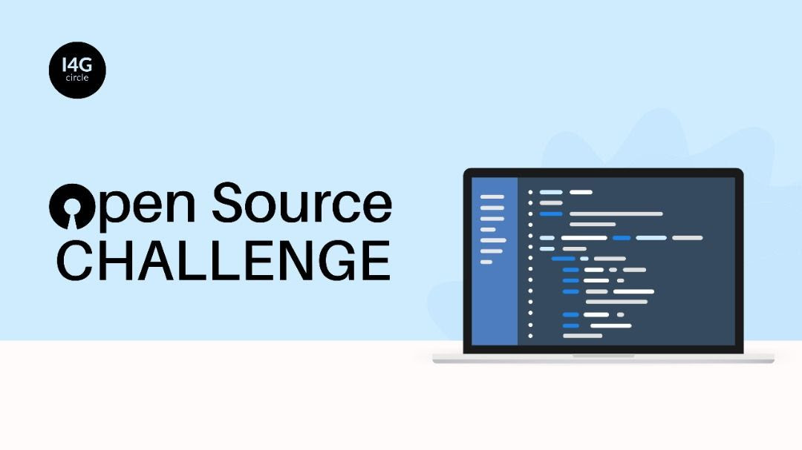

# I4G OPEN-SOURCE FRONTEND PROJECT 2022 🔥

## Contributing to the project

Please make sure to read the relevant section before making your contributions, it will make it a lot easier for maintainers to make the most of it and smooth out the experience for everyone involved. 🚀

**Table of Contents**

- [Introduction](#introduction)
- [Intended Audience](#intended-audience)
- [How to contribute](#how-to-contribute)
- [Issues](#working-with-issues)
- [Submitting Changes](#submit-changes)
- [Communication](#communication)
- [Code of Conduct](#code-of-conduct)
- [Licensing](#licensing)

## Introduction

HacktoberFest is back again!. Much appreciation for your desire to participate in the I4G OpenSource. Frontend project. See the [table of content](#contributing-to-the-project) for different ways to help and details about how this project handles them!📝

## Intended audience
- Project contributors
- Frontend Web developers
- UI/UX Designers
- Issue reporters
- Improvement reporters

## How to contribute

- You need a [GitHub](https://www.github.com) account
- You need a local "fork" of this Github repo.
- Clone the repository to your local machine.
- Submit an [issue](https://github.com/Ingressive-for-Good/I4G-OPENSOURCE-FRONTEND-PROJECT-2022/issues) ticket if there is none yet.

## Working with Issues

Click `issues` in the repository to see the reported issues.

## Submitting an Issue

- Describe the issue and include steps to reproduce it if it is a bug.
- If you are able and want to fix this, fork the repository on GitHub
- **See [Issue Template](./issue_template.md) for a formatted way of submmiting an issue.**

## Submit Changes

- Please avoid working directly on the exisiting branches.
- In your forked repository, create a branch for your upcoming patch. (e.g. feature--autoplay or bugfix--ios-crash)
- Make sure you stick to the coding style that is used already.
- Check for unnecessary whitespace with `git diff --check` before committing.
- Assure nothing is broken by running all the tests.
- Push your changes to the your branch in your forked repository.
- Open a pull request to the original repository and choose the right original branch you want to patch. 
- If not done in commit messages (which you really should do) please make reference and update your issue with the code changes. But please do not close the issue yourself.
- Do NOT commit to other contributor's codebase/issue without their consent.
- You can modify previous solutions if you feel like your solution has better Time or Space complexity.
- Even if you have write access to the repository, do not directly push or merge pull-requests. Let another team member review your pull request and approve.

## Code of conduct

- Kindly check the [code_of_conduct.md](./code_of_conduct.md) for a complete detailed information.

## Communication

- Twitter: [Ingressive for Good](https://twitter.com/Ingressive4Good)
- Telegram: [I4G OPEN SOURCE CHALLENGE 2022 CONTRIBUTORS](https://t.me/+pL8u3OvU-ss3MTk0)

## Licensing
The I4G frontend 2022 project is an open source and under public licensing. Let's all Contribute!😃